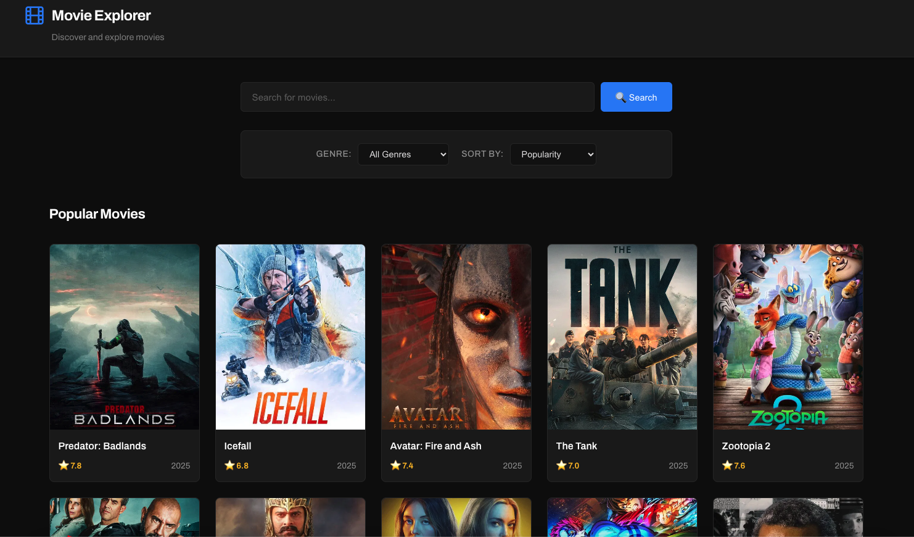
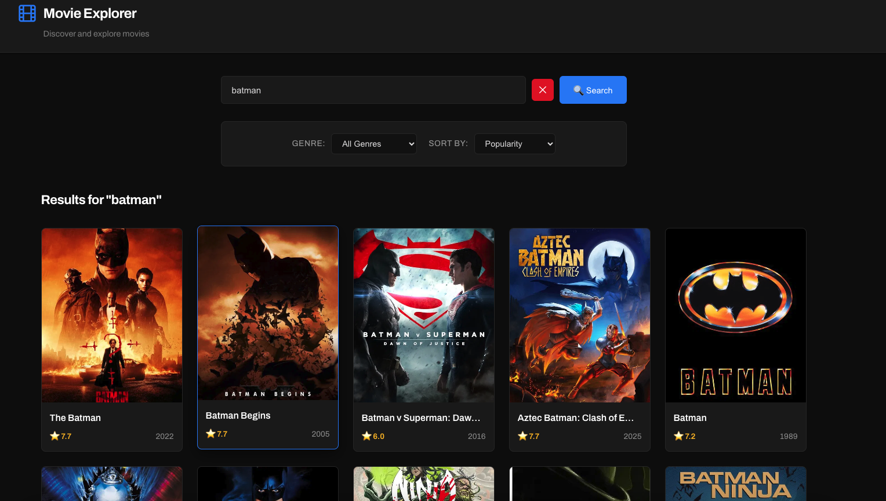
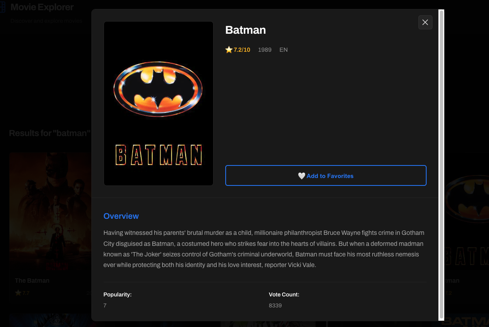
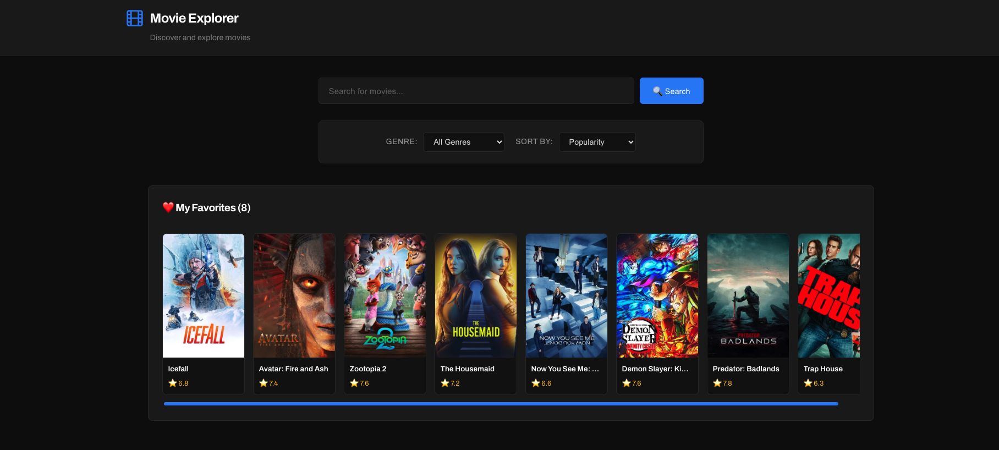
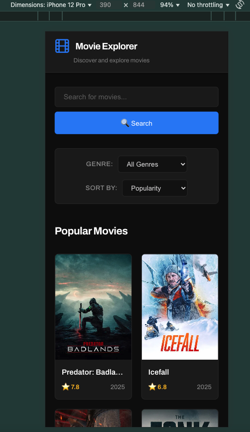

# 🎬 Movie Explorer

A modern React application for discovering and exploring movies using The Movie Database (TMDB) API.



## 🌟 Features

- **Search Movies** - Real-time search with debouncing for optimal performance
- **Filter by Genre** - Browse movies by Action, Comedy, Drama, and more
- **Sort Options** - Sort by popularity, rating, release date, or title
- **Favorites System** - Save favorite movies with localStorage persistence
- **Movie Details** - View comprehensive information in an elegant modal
- **Responsive Design** - Fully optimized for desktop, tablet, and mobile
- **Professional UI** - Clean, modern interface inspired by industry-leading platforms

## 🚀 Live Demo

**[View Live Site](https://gabrielvizcainomusiced-coder.github.io/movie-explorer/)**

## 🛠️ Tech Stack

- **React 18** - Component-based UI library
- **Vite** - Next-generation frontend build tool
- **TMDB API** - Movie data and imagery
- **CSS3** - Custom styling with Grid and Flexbox
- **LocalStorage API** - Client-side data persistence
- **GitHub Pages** - Hosting and deployment

## 📋 Key Features Explained

### Search Functionality
- Debounced search (500ms delay) to minimize API calls
- Clear button to reset search quickly
- Real-time results as you type

### Filter & Sort System
- Genre filtering fetches from TMDB's genre endpoint
- Multiple sort options (popularity, rating, date, alphabetical)
- Filters work seamlessly with search results

### Favorites Management
- Add/remove movies with one click
- Persists across browser sessions using localStorage
- Horizontal scrollable favorites bar for quick access
- Visual indicators show which movies are favorited

### Responsive Grid Layout
- CSS Grid with `auto-fill` and `minmax()` for automatic columns
- Adjusts from 6 columns (desktop) to 2 columns (mobile)
- Smooth hover effects and transitions

## 🎨 Design Decisions

- **Dark Theme** - Reduces eye strain and highlights movie posters
- **Blue Accents (#3b82f6)** - Professional color that suggests trust and quality
- **Archivo Font** - Modern, cinema-quality typography
- **Film Strip Icon** - Custom SVG for brand identity
- **Minimal Header** - Maximizes screen space for content

## 📦 Installation & Setup

### Prerequisites
- Node.js (v16 or higher)
- npm or yarn
- TMDB API Key ([Get one here](https://www.themoviedb.org/settings/api))

### Installation Steps

1. **Clone the repository**
```bash
   git clone https://github.com/gabrielvizcainomusiced-coder/movie-explorer.git
   cd movie-explorer
```

2. **Install dependencies**
```bash
   npm install
```

3. **Create environment file**
```bash
   # Create .env file in root directory
   touch .env
```

4. **Add your TMDB API key**
```
   VITE_TMDB_API_KEY=your_api_key_here
```

5. **Run development server**
```bash
   npm run dev
```

6. **Open in browser**
```
   http://localhost:5173
```

## 🚢 Deployment

This project is configured for GitHub Pages deployment:
```bash
npm run build
npm run deploy
```

## 📁 Project Structure
```
movie-explorer/
├── src/
│   ├── components/
│   │   ├── Header.jsx          # App header with logo
│   │   ├── SearchBar.jsx       # Search with debouncing
│   │   ├── FilterBar.jsx       # Genre and sort filters
│   │   ├── MovieCard.jsx       # Individual movie display
│   │   ├── MovieGrid.jsx       # Grid layout container
│   │   ├── MovieDetail.jsx     # Modal with full details
│   │   ├── FavoritesList.jsx   # Horizontal favorites scroll
│   │   ├── LoadingSpinner.jsx  # Loading state component
│   │   └── Footer.jsx          # App footer
│   ├── services/
│   │   └── tmdbAPI.js          # All API call functions
│   ├── App.jsx                 # Main app component
│   ├── main.jsx                # React entry point
│   └── styles.css              # All application styles
├── .env                        # Environment variables (not in repo)
├── .gitignore                  # Git ignore rules
├── index.html                  # HTML entry point
├── package.json                # Dependencies and scripts
├── vite.config.js              # Vite configuration
└── README.md                   # This file
```

## 🔑 Key Code Concepts

### State Management
- Uses React hooks (`useState`, `useEffect`, `useCallback`)
- Centralized state in App.jsx
- Props drilling for component communication
- LocalStorage for persistence

### API Integration
- Async/await for clean asynchronous code
- Try-catch error handling
- Multiple endpoints (search, popular, discover, genres)
- Image URL helper function

### Performance Optimizations
- Debounced search to reduce API calls
- useCallback to prevent unnecessary re-renders
- CSS animations with hardware acceleration
- Lazy loading of modal content

## 🎯 Future Enhancements

- [ ] Movie trailers (YouTube integration)
- [ ] User reviews and ratings
- [ ] Watchlist separate from favorites
- [ ] Dark/Light mode toggle
- [ ] Similar movies recommendations
- [ ] Infinite scroll pagination
- [ ] Advanced filters (year range, rating range)

## 📸 Screenshots

### Desktop Homepage


### Search Results


### Movie Detail Modal


### Favorites Section


### Mobile View



## 🤝 Contributing

This is a portfolio project, but feedback and suggestions are welcome! Feel free to open an issue or reach out.

## 📄 License

This project is open source and available under the [MIT License](LICENSE).

## 👨‍💻 Author

**Gabriel Vizcaino**

- Portfolio: [Your Portfolio Link]
- GitHub: [@gabrielvizcainomusiced-coder](https://github.com/gabrielvizcainomusiced-coder)
- LinkedIn: [Your LinkedIn]

## 🙏 Acknowledgments

- [The Movie Database (TMDB)](https://www.themoviedb.org/) for the excellent API
- [React](https://react.dev/) for the amazing framework
- [Vite](https://vitejs.dev/) for the blazing-fast build tool
- Design inspiration from [Letterboxd](https://letterboxd.com/) and [OMDb](https://www.omdbapi.com/)

---

**Built with AI assistance for automated tasks using prompt engineering